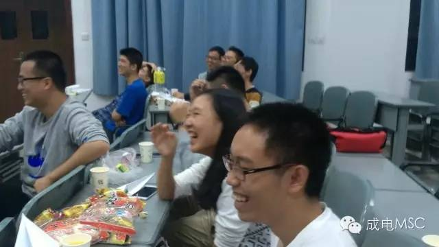
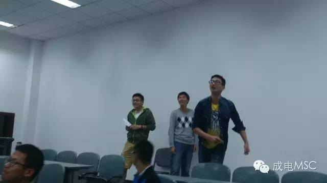
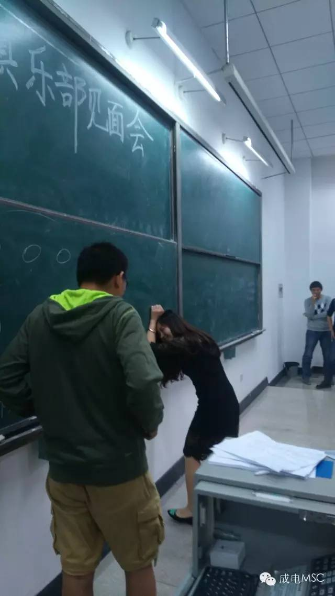
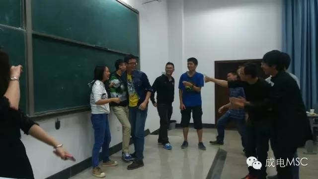

2015年10月9日晚7：00，成电微软俱乐部在品学楼A106举行了第一次见面会暨内建活动，旨在帮助俱乐部成员相互了解，增进友谊，从而提升整个俱乐部的凝聚力。

<!-- More -->

活动开始，首先由张帆主席讲话。主席提到，俱乐部是大家的俱乐部，大家要有主人翁精神。以俱乐部为平台，展示自己，锻炼自己，成就自己。随后主席与各个部门负责人进行了自我介绍，向大家分享了自己学习、活动的经历并且明确了各部门的职责。会上还请到了上届主席张明群向大家分享了自己三年俱乐部的经历，整个过程掌声雷动。

随后在财务部部长梁浩东的主持下，随机分为了5个小组，每个小组5—6人，每小组由一名部长带领，准备进行小组对抗。为了帮助大家更加熟悉俱乐部的其他成员，此次分组有意将同部门的人员错开，如此更方便大家跨部门交流。期间人力资源部部长夏雪还向各小组分发了零食与饮料，玩好也别忘了吃好呀。

小组分配完毕，各小组有10分钟的时间让成员间相互熟悉。一时，教室一片火爆，大家都聊得火热兴起。第五小组在部长马洪亮的带领下更是玩起了“名字接龙”的游戏，好生热闹。

1

第一个游戏：折飞机。每个小组用所给的A4纸折出三个纸飞机，从教室的最后方向讲台处试飞，若飞机飞至黑板的上、中、下，分别记4、3、2分。各小组有8分钟的制作和试飞时间。

在主持人梁浩东部长的开始令下，教室各种纸飞机已纷纷出厂试飞，一架架歼10、20、30翱翔天际。当然啦，那种技术不到家的自然是出师未捷身先死啦！不过也有技术过硬，赶英超美的，居然飞到了黑板的最上方，直击灯管！大家都叹为观止。直呼歼100就是牛

试飞之后，比赛正式开始，原本被看好的第三组出现了滑铁卢，歼100起飞过高，中途遭遇阻击，被天花板一掌拍下，真是可惜，而第五组凭借稳扎稳打的技术，拿到了两个2分，领跑积分榜。

2

第二个游戏：肢体传话。以小组为单位上台表演，第一个人从主持人处获得题板上的成词语，用肢体语言表演给第二个人，整个过程不能发出一点声音，也不能用口形，第二人再以同样的方法传递给第三个人，以此类推。

首先上场的是第五组，一个广场舞的表演，引爆全场，卓识让大家开了眼。随后第四组的挤公交表演也是蛮拼的，愣是将黑板比作了车窗，每传递一次，便撞击一次黑板，让人大呼过瘾。最让人沸腾的是第三组的上厕所的表演，一帮男生中偏偏夹带了个人力资源部部长夏雪（女），这样的场面怎能让人错过？手机的摄像头如饥似渴得捕捉着这样的饕餮盛宴。

3

第三个游戏：一元五角。（1）为充分表示重视会里的女性朋友，规定每个女生代表“一元”，每个男生代表“五角”。 （2）报名参加者一男一女分隔开围成一个大圆圈，组织者说开始，大家就手拉手围着圆圈走。（3）组织者大声说出一个金额，参加者在最短的时间内找到朋友抱在一起组成组织者要求的金额。例如：听到口令“二元五角”，可以的组合为：两个女生+一个男生；或五个男生；或一个女生+三个男生 没有找到朋友和组合数字不正确的遭到淘汰。（4）经过几轮，最后站在一起的一个小组获胜，获胜组人数控制在三至四人以内，也就是说如果超过这个人数还要加赛。胜利的2至3人获奖。

游戏的高潮出现在游戏中期，当人数只剩下一半的时候，主持人喊出了一块，此时，一场为争夺市场部马洪亮的战争打响了。这是两个男的为了另一个男的战争：紧抱，扭扯，摔倒，死不放手。一个堂堂八尺男儿，被人争夺……这画面太美，我不敢看。最后由第三组的三名成员留在舞台上而结束。原来他们早有预谋有木有！赢了的当然少不了奖品啦！

本次活动充分调动了成员的激情与活力，加强了俱乐部成员的相互认识，融洽了俱乐部氛围，完成了”学在微软，玩在微软“的目标，这样的活动以后还会继续。

