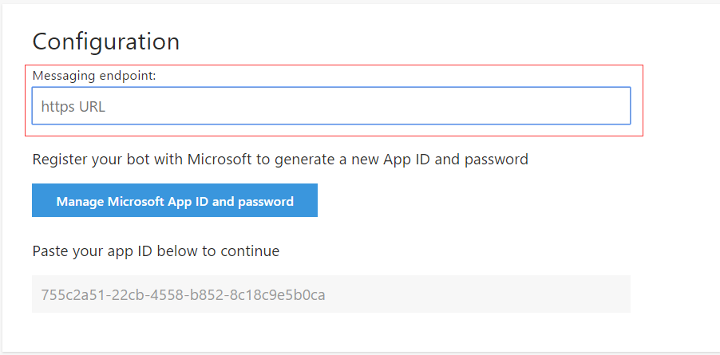

关联配置其实也很简单，但是在这之前首先你要有一个服务器来搭载你的Bot服务

<!-- More -->

传送门列表：

- [将Bot发布至Azure云（困难度I）](http://119.23.17.142/【bot-framework完全攻略】666-1-将bot发布至azure云（困难度i）/)
- [将Bot发布至本地服务器（困难度II）](http://119.23.17.142/【bot-framework完全攻略】666-2-将bot发布至本地（困难度ii）/)
- 将Bot发布之远程服务器（困难度III）

在搭建好服务器之后， 把https://your_bots_hostname/api/messages 中间的your_bots_hostname替换成你获得的服务地址，这些都应当是你在发布过程中配置好的

在本地的Bot项目中 通过解决方案管理器找到Web.config，找到如下部分并填写。要填的东西就是之前我告诉你妥善保管好的App ID还有密钥

填写完之后保存，并且重新发布到你的服务器。。。

在Bot官网中进入My bots，选择你要配置的Bot，之后再你看到的面板中点击这里：

之后找到这里，输入你的endpoint：

最后保存配置

回到那个总览的面板，下方有测试连接的按钮

如果你的所有东西都配置好了，看到的应该和我的不一样。。。

好吧我折腾了一小会，当你把一切都配置完了，并且测试成功应该是这样的：

至此，简单的开发流程你应该已经了解了。
