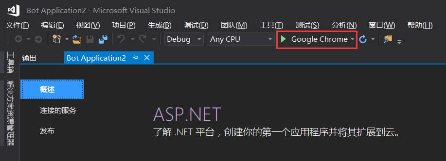

首先我们一起来导入模板。首先我可耻的说我用的是中文系统+中文VS+中文解说0.0

<!-- More -->

你如果还没下载模板文件，传送门附上：http://aka.ms/bf-bc-vstemplate

Visual的项目文件，以及用户自定义模板默认位置都在 “用户的文件夹/文档”这一路径下，如果你用过更老的Windows，这里的位置应该叫我的文档0.0。呸！费了这么多话，也许一张图就能解决问题：

注意打开你对应版本的文件夹 比如我就要打开Visual Studio 2017（我也不知道为什么我会有一个2013。。。）

进入这个目录下的\Templates\ProjectTemplates文件夹，这是用户自定义模板的大本营

如果你看见了一个叫Visual C#的文件夹，那就把模板文件丢到里面，如果没有也没关系，直接放在根目录好像也行。

到这模板就导入完成了。

打开你的Visual Studio，新建一个项目，位置在顶部的 文件>新建>项目

在打开的窗口中 依次选择 模板>C#>Bot Application 点击确定

你就会看到如下场景：

左面的解决方案管理器中可以看到项目的所有文件，如果你没有看到解决方案管理器，他可能像工具箱一样在左面被折叠了起来

还是没有的话 到顶部菜单的 视图>解决方案管理器 去打开

你可以顺便看看项目的结构（如果你看得懂）

接下来就可以开始本地调试（就是在本地测试一下你的Bot，先和自己做的Bot聊聊。。。）

点击上面的按钮或者按F5开始调试，之后你应该看到下面的窗口，或者类似的东西。（如果调试不成功，显示代码有错误，你可以等一等，因为Bot SDK正在后台自动下载）

读完上面的网页你会看到有个词叫endpoint，你可以暂时的把它理解成Bot服务的网址。上面网址localhost:3979就是本地调试的your_bots_hostname。所以开启调试后我的Bot的endpoint就是https://localhost:3979/api/messages你的应该和我的差不多，有的时候3979端口会被占用那么上面的网址给你的就是其它端口。

另外，在这里有一点需要注意，虽然在我们的认识中 localhost = 127.0.0.1 但是在这里是不能替换的，具体原因可以自行查阅相关资料。

接下来，你只需要打开你的模拟器了。如果你还没有，传送门：https://emulator.botframework.com/

安装以后打开你的模拟器：

左边是聊天窗口，右边是控制台。在开始之前，点击聊天窗口顶部的Enter your endpoint URL 并且输入我们之前获得的endpoint:

注意，由于我们是本地测试，所以其他的一律不填，点击CONNECT继续，这时候你会发现控制台有了变化 POST 200代表发送数据成功，如果你看到了红色的文字，出现了错误，可以重启一下这个模拟器，可能会解决问题，如果出现了问题不能解决，可以到俱乐部的QQ群提出，也可以直接问学长（不要问我啦）

这个应该是一切就绪时你会看到的：

我对我的Bot说了句Hello。。。。

看得出Bot有了回应，控制台也有了变化，这就是一般Bot调试的流程，如果出错了，就分析控制台Log的内容。再次说明，看不懂的Log(日志)和其他的东西要问哦。

至此，一个你的基本的Bot就构建并测试完成了！
