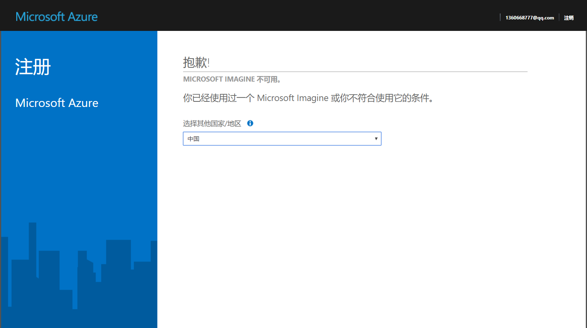

把Bot发送到Azure云上是最简单方便的选择了，而且Azure云有个学生免费的许可，是专门用来搭载像Bot这样的网络应用的。学生免费请注意！！！

我还没说怎么发布你的项目0.0，不过在这之前我先带你申请一个那个学生免费的许可。Dreamspark传送门：[www.**dreamspark**.com/](http://www.dreamspark.com/)

<!-- More -->

首先你得用自己的Microsoft账号登陆（网页右上角）。

然后点击Account，进入账户设置：

然后你首先要完善个人信息。。。

然后就会进入真的Account页面。。。：

页面左下角的Get Azure就是获取免费Azure的地方，点击Active Azure，你会看到如下的东西：

红框中的 Register now是灰的，也就是说我们现在不能马上就申请，因为我们还没进行学生认证。下面蓝色的链接就是认证的链接。

点击之后，会提示你选择认证方式。偷偷告诉你，学校邮箱（School email address）最稳妥。。。：

然后你就输入你的学校邮箱，Micorsoft会给你的邮箱发邮件，就像一般的注册游戏账号的认证过程一样。。。。。讨厌死了手动复制链接地址：

不出意外的话链接会跳转到Account页面，此时Register now还是黑的，还需要点击下面蓝色的链接，然后才能完成验证（点击Continue）：

回到Account界面的你发现Register now还是灰的。。。。不过其实已经可以点进去了（仔细一点看你会发现字变成黑色了）

之后就进入了Azure云的登陆页面（不得不说画风突变）

登陆之后会有一些简单的设置

如果遇到下面的问题，就把国家改成美国。。。

之后又是简单的填写个人信息，协议条款。

填写完之后Azure会开始在服务器部署你的工作空间。趁着这个时候，泡杯柠檬茶(੭ु•́ω•̀)੭ु

开始使用免费的Azure喽！！！

看到Azure丰富等功能了没。感觉兴奋的同学你别高兴的太早，感觉复杂的同学你也不要嫌烦，点击左上角的新建，看看你可以新建什么。

看完之后你的表情：(→_→)

只有这一个能用啊。。。（免费给你用就不错了好吗）：

既然就有这个能用，你就新建一个用用看：

填完东西，点创建就好。。。

Azure会开始部署你的Web App，不过这些你都不用管了，因为我们也用不到了。刚刚新建一个网络应用的目的其实是顺便创建一个新的资源组以及，，，让你感受一下微软的学生认证免费版的。。。。（我不说，你也别猜）

把网页全都关了（别关我这个教程），打开你的VS，进入你的项目。

这样点击发布：

或者这样：

进入发布页面，发布目标当然是Azure云，然后下面的新建/选择现有的选项也不用动，因为我们是第一次发布。

点击确定就可以了。

在创建App Service的界面，如果你的表单保持一片空白不能更改，那不是你的错。。。全都关了，喝完柠檬茶在打开吧（玄学问题 重启就好）。

表单自动填写完毕就可以点击创建。创建好了应该会自动发布吧，不会的话你就再发布一次。

如果发布失败了可以百度，谷歌，问学长

成功了的话，蓝色的网址就是bot的那个什么了。。。。（你懂就行）：

发布成功，你的Bot就被怼上了你的Azure。

最后注意下endpoint：

我的那个什么是 http://botapplication220170429091745.azurewebsites.net/

那么endpoint就在后面加上api/messages

即 http://botapplication220170429091745.azurewebsites.net/api/messages

大功告成！
