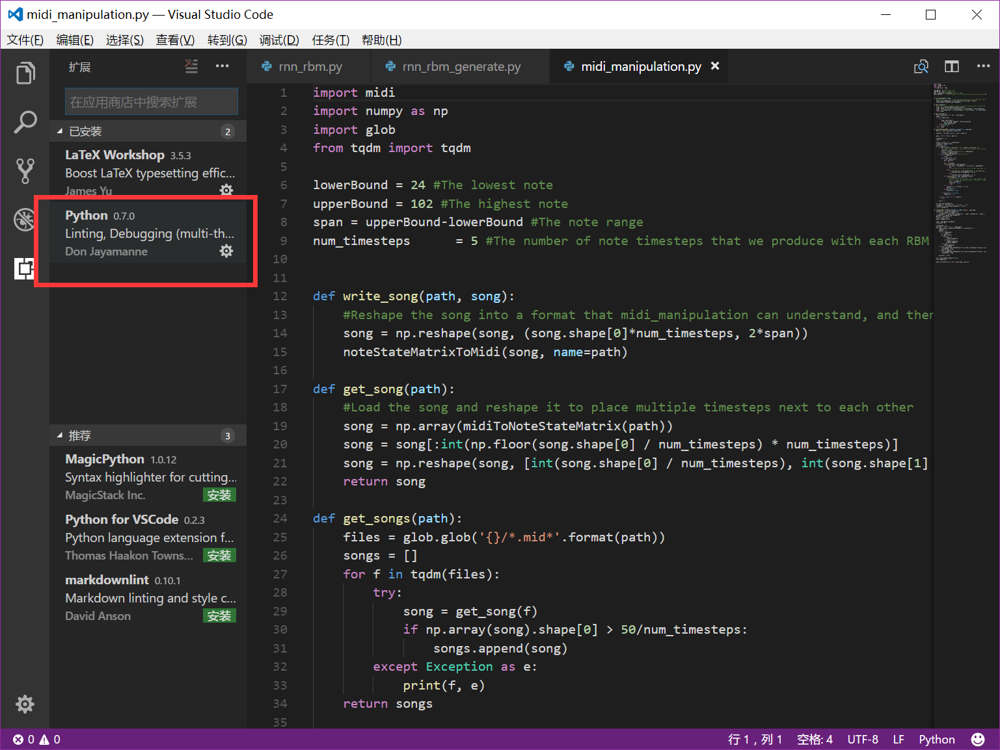

回到之前那个Hello World程序来。

如果我们使用文本编辑器（如Spyder，Atom，VS Code，Sublime）编写程序，那么这个程序要怎么运行的好呢？

<!-- More -->

我们首先编写一个这样的程序。打开Visual Studio Code，首先安装python插件，这个插件可以很好地帮助我们写Python代码。

之后我们ctrl+N新建一个文件，编写代码，按下ctrl+S，以python文件形式保存。

于是我们得到了hello.py.

之后打开cmd，这样运行程序。

执行的指令是：python hello.py

------

回到正题，在这个程序里面，什么是输入，什么是输出？

在console里，我们使用了print()函数，括号里面的是输入，返回的值就是输出。

现在我们尝试一个这样的代码：

理所当然地，它会返回300.在这里的输入是100+200，而输出是300.当然print()函数接受多个输入，只要加入逗号就可以了：

我们再看另外一个函数，input()。input()是最典型的输入函数。现在我么认识一个符号：   =

=可以将=右边的值赋值到=左边去。比如：x=300，这样你就将300赋值到了x上。

接下来我们尝试这么做：

我们成功地完成了一次输入。input里面可以填写参数，比如：

显示出了一些与输入有关的提示符。

接下来，我们将输入输出函数组合成一个程序：

\n是换行符，请将它放进字符串里，因为\n本身是一个和单词一样的特殊字符。

这样，我们终于写出了一个与用户可以交互的程序了。

------

tips：sss

1，eval()函数代表，执行括号里面的句子。比如说eval(2*300)，会返回这个算术的值。**你可以用这个函数，一行代码写一个计算器。**
