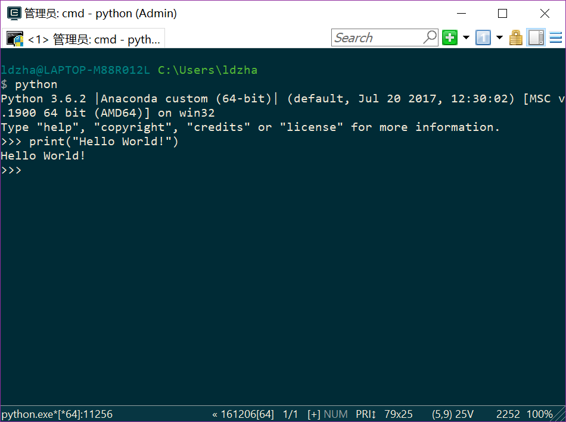

各位萌新们大家好啊！这里是划水主席逸霄。根据我们之前约定的培养计划，我现在要写第一课了。

<!-- More -->
------

**Python是一门怎样的语言？**

Python是一门非常流行的解释型高级语言。现在，全世界差不多有600多种编程语言，但流行的编程语言也就那么20来种。如果你听说过TIOBE排行榜，你就能知道编程语言的大致流行程度。

总的来说，这几种编程语言各有千秋。C语言是可以用来编写操作系统的贴近硬件的语言，所以，C语言适合开发那些追求运行速度、充分发挥硬件性能的程序。而Python是用来编写应用程序的高级编程语言。

当你用一种语言开始作真正的软件开发时，你除了编写代码外，还需要很多基本的已经写好的现成的东西，来帮助你加快开发进度。比如说，要编写一个电子邮件客户端，如果先从最底层开始编写网络协议相关的代码，那估计一年半载也开发不出来。高级编程语言通常都会提供一个比较完善的基础代码库，让你能直接调用，比如，针对电子邮件协议的SMTP库，针对桌面环境的GUI库，在这些已有的代码库的基础上开发，一个电子邮件客户端几天就能开发出来。

Python就为我们提供了非常完善的基础代码库，覆盖了网络、文件、GUI、数据库、文本等大量内容，被形象地称作“内置电池（batteries included）”。用Python开发，许多功能不必从零编写，直接使用现成的即可。

除了内置的库外，Python还有大量的第三方库，也就是别人开发的，供你直接使用的东西。当然，如果你开发的代码通过很好的封装，也可以作为第三方库给别人使用。

Python的主要优点是：简单、适合快速开发。

Python的主要缺点是：慢、保密性差。

有关Python的介绍，请看廖雪峰的相关文章：[Python简介](https://www.liaoxuefeng.com/wiki/0014316089557264a6b348958f449949df42a6d3a2e542c000/001431608990315a01b575e2ab041168ff0df194698afac000)


------

**如何安装Python呢？**

首先这里默认你使用了Windows系统。我们首先打开Python官网：https://www.python.org/

之后找到32位或者64位的版本进行下载就好了。注意关于Python的版本号选择，因为Python3已经具有广泛的应用，是Python的现在和未来。所以本教程将会立足于Python3来进行讲述。请各位下载Python3的最新版本：Python 3.6.2.


在安装的时候，请勾选：Add Python to path这一项，即将Python加入到环境变量。当然之后手动操作也是没问题的。这样配置的好处是，你可以直接在cmd，Powershell里启用Python.

当我们编写Python代码时，我们得到的是一个包含Python代码的以`.py`为扩展名的文本文件。要运行代码，就需要Python解释器去执行`.py`文件。

由于整个Python语言从规范到解释器都是开源的，所以理论上，只要水平够高，任何人都可以编写Python解释器来执行Python代码（当然难度很大）。事实上，确实存在多种Python解释器。

当然我们也可以选择更加集成的环境，即使用IDE。

**集成开发环境**（Integrated Development Environment，简称**IDE**，也称为Integration Design Environment、Integration Debugging Environment）是一种辅助程序开发人员开发[软件](https://zh.wikipedia.org/wiki/軟體)的[应用软件](https://zh.wikipedia.org/wiki/應用軟體)，在开发工具内部就可以辅助编写源代码文本、并编译打包成为可用的程序，有些甚至可以设计图形接口。

IDE通常包括[编程语言编辑器](https://zh.wikipedia.org/wiki/文本编辑器)、[自动构建](https://zh.wikipedia.org/wiki/自动构建)工具、通常还包括[调试器](https://zh.wikipedia.org/wiki/除錯器)。有些IDE包含[编译器](https://zh.wikipedia.org/wiki/編譯器)／[解释器](https://zh.wikipedia.org/wiki/直譯器)，如微软的[Microsoft Visual Studio](https://zh.wikipedia.org/wiki/Microsoft_Visual_Studio)，有些则不包含，如[Eclipse](https://zh.wikipedia.org/wiki/Eclipse)、[SharpDevelop](https://zh.wikipedia.org/wiki/SharpDevelop)等，这些IDE是通过调用第三方编译器来实现代码的编译工作的。

这里推荐两种IDE。

1，Anaconda 4.4 这也是我正在使用的IDE，集成了IPython，Jupyter Notebook，Spyder，以及会为你预先安装好数量丰富的第三方库。一般来说，数据分析、机器学习领域的程序员会非常喜欢Anaconda。conda还提供了一个指令来替代pip，从而实现灵活的包管理，并且可以灵活的使Python多版本共存。Anaconda下载地址：https://anaconda.org/

当然对于Anaconda来说你也可以先装Anaconda再在里面装Python。同样，建议把Anaconda加入环境变量 add anaconda to PATH。


这是Anaconda Navigator的一个界面，右边是集成好了的常用Python库。个人非常推荐使用Anaconda。**注意：在进行包管理的时候，Anaconda通常会加入清华的源。**

2,PyCharm，专业Python IDE，饱受好评，JetBrains出品必属精品，非常适合专业开发。其专业版可以通过UESTC的学生邮箱来获得。请使用学生邮箱注册账号，获得免费的专业版。下载地址：https://www.jetbrains.com/pycharm/

------

接下来我推荐一个美化插件：ConEmu，提供了一个cmd和powershell的更好看的前端：https://conemu.github.io/

默认启动界面请选择cmd（Admin），相对来说比较好用。当然powershell（Admin）也是没问题的。

之后，我们开始我们的第一次编程。

------

**Hello World！**

打开ConEmu：


输入`python`.

然后输入

```
print("Hello World!")
```



如果一切正常，你将看到Hello World！从现在开始，你已经正式迈向了Python开发者的道路。

Tips：

1，Python3的print()是函数，而Python2的print 是指令。

2，Python解释器是逐行解释的，不会预先编译。

3，Python不区分单引号”和双引号””。

------

**有什么参考书推荐吗？**

1，《Learn Python The Hard Way》，注意购买Python3版本。

2，《Python核心编程（第2版）》《Python基础教程（第2版·修订版）》

3，廖雪峰的Python3教程
