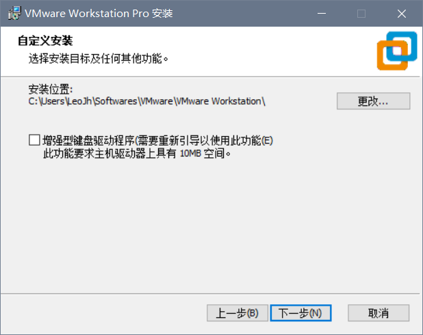
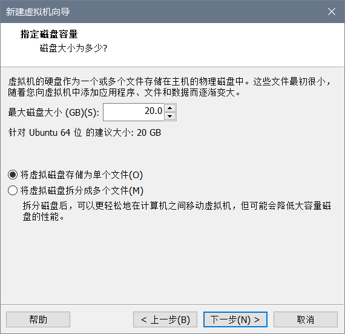
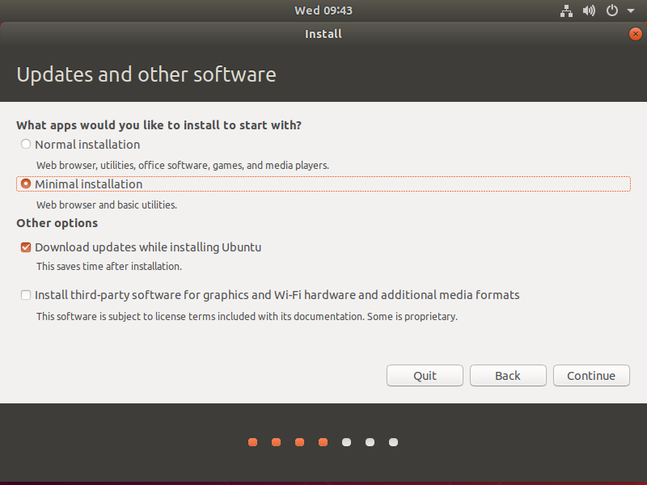
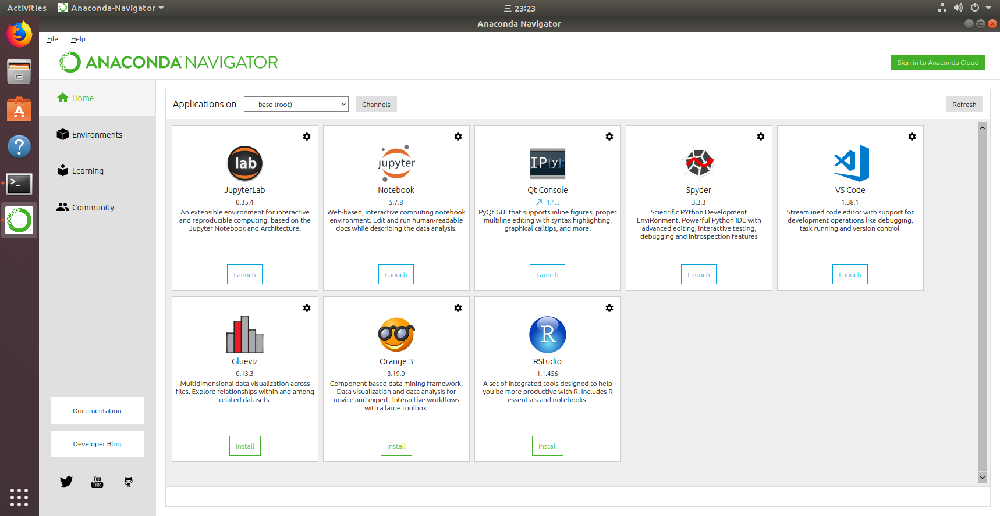

我们这个在Windows的Ubuntu虚拟机里的Python环境配置分四步:

- 安装Vmware Workstation Pro 15
- 创建Ubuntu18.04虚拟机
- 安装Ubuntu系统
- 在虚拟机安装Anaconda3

## 安装VMware Workstation 15 Pro

我们通常说的安装Vmware说的是**VMware Workstation Pro**, 是付费的 (可以在网上找激活码来激活), 其实另外有**Vmware Workstaion Player**, 个人使用的话是免费的,安装包也比Pro小不少 (Pro大约550M, Player大约140M), 它们的区别仅在于Pro版多了共享剪贴板, 快照, ssh连接Linux虚拟机, 同时运行多个虚拟机, 运行加密虚拟机等一些功能, 体验更好, 因此**推荐安装Vmware Workstaion Pro**.

:link: [最新版VMware Workstation Pro下载链接](https://my.vmware.com/cn/web/vmware/details?downloadGroup=WKST-1550-WIN&productId=799&rPId=37111)

:link: [最新版Vmware Workstation Player下载链接](https://www.vmware.com/cn/products/workstation-player/workstation-player-evaluation.html)

**本教程中安装的是Vmware Workstaion Pro**

安装过程只有:point_down: 这一个界面是需要操作的, **勾选增强型驱动程序**, **选一下安装位置**, 其他界面就按下一步之类的.



安装好后会提示重启一下,不过不重启也能继续下面的步骤.

第一次打开Vm会要求输入激活码, 这时输入我从网上随便搜的:point_down: 这个就能激活了

> ZC10K-8EF57-084QZ-VXYXE-ZF2XF


Vmware安装完成:tada:

## 创建Ubuntu18.04虚拟机

首先我们需要下一个Ubuntu Desktop安装镜像.

:link: [Ubuntu下载链接](https://cn.ubuntu.com/download)

虽然目前已经有了19.04版的Ubuntu, 但并不建议新手尝试, 这些刚出的版本通常包含很多仍在修复的错误, 并不适合新手学习Linux. 实际上大多数不是软件开发者的Ubuntu使用者不会可以追求新版本的Ubuntu, 现在仍有很多人用的是1604.

:bulb: **LTS**是**Long Term support**, 意味者长期支持, 这些版本会更稳定些. 非Ubuntu开发者通常选择这些版本的Ubuntu.

打开Vmware, 点击**创建新虚拟机**, 然后选择**稍后安装操作系统**


然后:point_down:


然后设置一下这个虚拟机在Vmware中的**名称**


然后是设置**虚拟机的硬盘大小**, 就用它的建议值就可以. 如果日后空间真的不够了, 还可以扩容, 或者可以考虑上实体Linux了. 下面这个选**将虚拟磁盘储存为单个文件就好**.



然后点**自定义硬件**, 将**ISO镜像**选为下好的Ubuntu镜像. 另外如果你想多分点内存给虚拟机, 可以把内存一项改大一些 (其实这些东西在虚拟机建好后仍能更改). 满意了就可以开始创建了.


## 安装Ubuntu系统

开机后, 系统语言选择英文 (即便选中文也没几句中文, 没意义)

:bulb: 目前Ubuntu画面只占了一部分屏幕, 一会安了Vmware增强工具就能全屏了.


接下来设置键盘布局, 除非是跟普通键盘不一样的键盘, 都是默认的这个**English (US)**不用改

:point_down: 这里为了节省时间选**最小安装**,刚试过普通安装需要约**40min**, 最小安装**十多分钟**. 当然最小安装只有很少的软件, 如果你有时间也可以选普通安装




点击**Install Now**后会提示选择时区. 在地图上的在中国上点一下就能把**Shanghai**填充上去

安装前的最后设置! **name**是你的昵称, 可以和用户名不同. **computer's name**是主机名, 稍后我们会看到主机名和用户名会用在什么地方.

:bulb: 用户名的格式较为严格, 只能用小写字母

:bulb: 可以选说**Log in automatically**, 开机进入桌面不需要输入密码


等一会就安装好了!


按<kbd>Ctrl Alt T</kbd>打开终端, 可以看到提示符中@前的便是**username**, @后的便是**hostname**


最后安装一下Vmware增强工具, 能更好适配. 在刚打开这个终端输入下面命令 (因为这个增强工具还没装上, 暂时无法共享Windows和Ubuntu剪贴板

```shell
sudo apt update
sudo apt install open-vm-tools-desktop -y
```

:bulb: `sudo`命令会要求你输入密码

然后在终端输入`reboot`重启一下, 就能在Windows和Ubuntu间共享剪贴板啦:tada:

:exclamation: 有一点比较坑, Vmware**不支持笔记本电脑自带触摸板的滚**动! 最好的解决方法是用鼠标.

## 安装Anaconda

首先需要下一个anaconda安装包. 从anaconda官网下太慢了, 可以从[清华anaconda镜像源](https://mirrors.tuna.tsinghua.edu.cn/anaconda/archive/)下载. 拉到最底下是最新版本. anaconda清华源曾经关闭过一段时间, [最近才恢复](https://zhuanlan.zhihu.com/p/62899936), 可能是因为还在更新所以清华源上最新版本还是一年以前的. 不过问题不大, 安好了再更新也是一样的.

:bookmark_tabs: [Anaconda安装文档](https://docs.anaconda.com/anaconda/install/linux/)

安装过程参考:point_up_2: 官方教程就好, 挺清晰的.

安装好后关闭运行anaconda安装脚本的那个终端, 再打开一个新的终端, 输入`anaconda-navigator`

在这里有anaconda配套的应用, 点击安装**VS Code**. 这样安装的好处是**开箱即用**: 打开VSC以后就能进行Python开发, anaconda已经将需要的插件, 需要的配置弄好了:thumbsup:



完成! 

这样我们就完成了基础版Ubuntu虚拟机中Python开发环境的搭建!

更多操作我们以后再做.