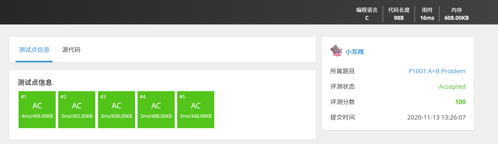

## 2020.11.13 前言 & 顺序结构

这里是成电微软学生俱乐部 2020 年度 C 语言学习 Guideline。虽然不少专业在大一上已经开设了 C 语言程序设计相关课程，但是仍有其他专业的同学没有学习 C 语言（比如计院 hhhh）。

本系列文章将用六个星期的时间讲述六个专题——————的题目。这些专题覆盖了编程入门（不仅是 C 语言）的最基本的要素，如果你已经精通了 C 语言（呃，是七天精通的那种精通），又正好在学习其他语言（如 Python、Java 亦或是 C# 等），你也可以参与其中，在学习的同时练习语法。

<!-- More -->

如果你还没有学习 C 语言，推荐翁恺 C 语言程序编程全系列，在 MOOC、[bilibili](https://www.bilibili.com/video/BV1sJ411E7St) 等视频网站上都能找到。（顺便安利翁恺老师的其他课程都很不错，老师很有人格魅力，声音还好听，女朋友就是看他的 Java 入门）。

不过，需要注意的是，每周一题专题并不是按照翁恺老师的 MOOC 的学习进度而设置的，而是使用了[洛谷](https://www.luogu.com.cn/)的程序设计入门题单。

洛谷是一个在线评测平台（Online Judge, OJ）。和平常的 `做题-对答案` 不同，在 OJ 中，你可以在线提交程序源代码（一般不限于 C 语言，根据系 OJ 支持情况而定），系统对源代码进行编译和执行，并通过预先设计的 `测试数据`（又称测试点）来检验程序源代码的正确性。OJ 常用于算法竞赛（如 OI、ACM 竞赛）中，也有面向求职者的 [Leetcode](https://leetcode-cn.com/)，我们学校计算机学院的[码图](http://matu.uestc.edu.cn)、软件学院的 [OSTEC](http://ostec.uestc.edu.cn/)。



对于洛谷，在提交代码以后，如果测试点显示 `AC(accepted)`，表示你提交的代码在这个测试点的输入下的输出与答案相同。如果所有测试点均为 `AC`，则**系统认为**你提交的代码是正确的，你会在右边收获一个绿色的 `Accepted`，你的个人主页的“通过”数也会 +1。

顺便一提，当代码复杂起来，如果想要严格证明代码、或者说算法的正确性，这是相当困难的。因此 OJ 普遍采用的方法是，使用多组测试样例（在 ACM 竞赛中，甚至可能上百、上千）来尽可能找到你的代码的错误。如果没有找到你的代码的错误，就**认为**你的代码是正确的（实际上并不一定是正确的）。

回归正题，我们第一周的题单是[顺序结构](https://www.luogu.com.cn/training/100)。题单中有 12 题，但你只需要完成 [P5704 【深基2.例6】字母转换](https://www.luogu.com.cn/problem/P5704) 和 [P5708 【深基2.习2】三角形面积](https://www.luogu.com.cn/problem/P5708) 即可。学有余力的同学可以选做题单中的剩下题目。六周以后，总共完成了 12 题及以上的 MSCer，将在年会获得精美小礼品一份~

下周五晚八点前，我会提供这两道题目的 C 语言题解和简单讲解，同时放出下一周的题单。如果在完成过程中遇到了任何问题，也可以在 MSC 群里放出代码，大家一起讨论（推荐使用 https://paste.ubuntu.com/ 粘贴代码，而不是把代码发到 QQ 聊天框、截图甚至使用手机拍电脑）。

最后，如果对这个版块有好的建议或意见（如题解不够详细、需要线下讲座等），欢迎私聊小灰晖~

## 2020.11.20 上周题解 & 分支结构

首先是上次顺序结构的题解！

单纯只出顺序结构相关的题，是不会像分支、循环、函数、结构体等后面的专题一样把 C 玩出花来。所以也就出一些基础一点的题加一点数学题（如果你想体验亿点数学题的话，可以看看[P2433 【深基1-2】小学数学 N 合一](https://www.luogu.com.cn/problem/P2433)）。

-------------

先看 [P5704 【深基2.例6】字母转换](https://www.luogu.com.cn/problem/P5704)。

题目要求将小写字母转换为大写字母。

C 语言中，字符 `char` 是按照 [ASCII 码](https://baike.baidu.com/item/ASCII)存储的，其中 ASCII 表可以百度到，也可以使用你手上的 C 语言编译器自己做一张表（但是这需要循环结构的知识，这里就先挖一个坑；如果你已经学会了循环结构，你可以提前做一张表）。

从表中可以注意到，大小写字母的 ASCII 码是一一对应的，同一个字母的大小写相差 32。于是，我们对字符变量进行运算：`输出字符 = 输入字符 - 32` 即可完成此题。

如果恰巧忘了 32 这个常量值，我们也可以让计算机自行计算出 `'a' - 'A'` 的值。如下面的代码：

```c
#include<stdio.h>

int main()
{
    char ch;
    scanf("%c", &ch);
    ch = ch - 'a' + 'A';
    printf("%c", ch);
}
```

也就是说，我们并不一定要死记 ASCII 码间的对应关系，而是让电脑自己去运算，这样代码的可读性也会更高。（如，将数字字符转为其数字值时，我更喜欢 `num = ch - '0';` 而不是 `num = ch - 48;`）

--------------

另外一题是 [P5708 【深基2.习2】三角形面积](https://www.luogu.com.cn/problem/P5708)。~~这道题公式都你糊脸上了，直接抄上去就行了~~程序员的事，能叫抄公式吗？那叫代码复用，我们要讲码德。

```cpp
#include<stdio.h>
#include<math.h>

int main()
{
    // float a, b, c, p, area;
    double a, b, c, p, area;
    scanf("%lf%lf%lf", &a, &b, &c);
    p = (a + b + c) / 2;
    area = sqrt(p * (p-a) * (p-b) * (p-c));
    printf("%.1f", area);
    return 0;
}
```

这道题如果使用 `float` 类型运算，最后一个测试点会 `Wrong Answer`，使用 `double` 才能全部通过。最后一个测试点的输入为 `888.88 888.88 888.88`，使用 `float` 的输出为 `342126.8`，而 `double` 的运算结果为 `342126.7`。

现实生活中，很多情况下一点误差是允许的，但对于 OJ 这类在线评测，要求结果和测试点的预期完全一样，因此在 OJ 提交时，我们一般都会使用更精确的 `double` 甚至 `long double` 类型进行运算，平时写代码的根据自己的需求（精确度、内存等）而定。

---------------

请提交成功的同学将自己的代码提交到 [GitHub 仓库](https://github.com/uestc-msc/2020-members)。

当然，如果你还不会使用 Git，你可以暂时不提交，之后我们会有关于 Git 的简单使用的[教程博客](https://blog.lyh543.cn/linux/introduction-to-wsl-ubuntu-and-git/)（暂时还没更新）和手把手教学沙龙，这周因为时间不合适，都咕咕咕了。待博客和沙龙都更新完了，各位可以再参考博客或沙龙，提交自己的代码。

---------------

这周的题单是[分支结构](https://www.luogu.com.cn/training/101)，16 道题必做的只有 [P5711 【深基3.例3】闰年判断](https://www.luogu.com.cn/problem/P5711) 和 [P5712 【深基3.例4】Apples](https://www.luogu.com.cn/problem/P5712)，都是在实际开发中经常遇到的情况（手写日期判断等情况，使用单数还是复数）。题解和下周题目会在下周五晚八点前公布~

## 2020.11.27 上周题解 & 循环结构

<!-- [WSL(Ubuntu)、Git 配置及简单使用](https://blog.lyh543.cn/linux/introduction-to-wsl-ubuntu-and-git/) -->
<!-- 打印 ASCII 表 -->
## 2020.12.4 上周题解 & 数组

## 2020.12.11 上周题解 & 字符串

## 2020.12.18 上周题解 & 函数与结构体

## 2020.12.25 上周题解 & 后记

<!-- 经过六个专题的练习，2020 年 C 语言入门将暂告一个段落。如果你完成了这些专题，或者虽然没有完成，但是有什么想说的，你可以填写[问卷](https://forms.office.com/Pages/ResponsePage.aspx?id=pOutbSzcpEiz8KuV1mGJ2iUUVS2WU1lBlFAHVjewFntUMUJTVjZKQUJNTFpHRTA1Q1VEWlAxVlJMWC4u)。在年会上，我们会以词云的形式展示这些建议，并在今后的专题中酌情采纳，也会想合格完成专题的同学送出精美小礼品。

那么，下一步是什么呢？

在寒假的时候，现役 ACM 校队成员 @OrangeRain 学长会延续这类专题的风格，推出数据结构与算法方面的每日一题，题量和难度会较目前有提升，欢迎各位持续关注。

除此之外，如果你想要系统性的自学数据结构与算法，并且喜欢 MOOC 这类学习类型，推荐这一门 MOOC：[【清华大学】邓俊辉 MOOC 数据结构与算法](https://www.bilibili.com/video/av75509584/)

如果你喜欢在 OJ 上做题的这类风格，你可以在 [LeetCode书架](https://leetcode-cn.com/leetbook/) 上找到《初级算法》，以及《中级算法》和《高级算法》，结合上面的 MOOC 边学边练。

如果你对数据结构与算法已经有一定了解了，并且想要定期或不定期地练习或参加比赛，你可以尝试 [LeetCode](https://leetcode-cn.com/) 的每日一题，或者参加 LeetCode（难度接近 `Div. 3`）、[CodeForces](https://codeforces.com/)（比赛难度由低到高依次为 `Div.3`，`Div.2`，`Div.1`）或 [AtCoder](https://atcoder.jp/)（难度由低到高依次为 `Beginner Contest`，`Regular Contest`，`Grant Contest`）举办的比赛。

如果你对数据结构和算法非常感兴趣，或有 OI 基础，你也可以参加算法竞赛（ACM ICPC、CCPC 等），我们学校 ACM 校队集训、招新一般在每年 4 月左右，在此之前你可以继续在洛谷做其他题，或自学[《算法竞赛入门经典（第2版）》(刘汝佳)](https://item.jd.com/11469701.html)。参加（包括但不限于算法竞赛）竞赛可以获得保研加分、面试优势等。

最后的最后，如果你想要尝试程序开发，俱乐部正计划将《阮薇薇点名啦》小程序进行重构，想要参项目开发、成为《阮薇薇点名啦 v2》开发者的同学（零基础也行的~），欢迎联系小灰晖。 -->
