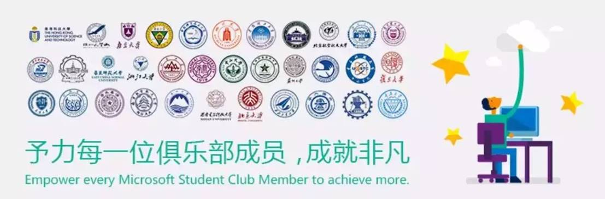

“微软学生俱乐部”（Microsoft Student Club, 简称 MSC）是微软亚洲研究院 （Microsoft Research Asia, 简称 MSRA）与高校合作培养人才的一种探索。目前MSC只在34所双一流建设高校开设，四川地区仅有电子科技大学与四川大学设有。

电子科技大学微软学生俱乐部成立于2002年，是一个具有17年历史的老牌学生组织。秉承着俱乐部“学习先进技术、开拓创新思维、体验多元文化、成就一流人才”的宗旨，在校团委以及相关学院的指导下，通过技术沙龙、实践空间站项目、编程一小时、HACKATHON、创新杯等活动，培养学生的创新头脑，实践能力和组织能力。让来自不同学院的同学得以展现才华，共同成长。

## 技术部

俱乐部成员通常以技术爱好者为主，主要承担着俱乐部内的技术交流讨论和技术沙龙的承办。针对于大一零基础的同学，我们提供新人培训计划，酌情开设C/C++,Python，C#等方向的培训，同时负责答疑解惑。不用担心你是小白零基础，只要你对技术感兴趣，能坚持，我们会陪伴你成长。

## 运营部

并不是每个MSCer都得码代码，如果你兼具文艺气息和科技属性，媒体运营的工作非常适合你。我们有微信公众号、微博、b站、网页，四大平台承载你的文思泉涌、妙笔生花。文案、美工、视频拍摄剪辑，艺术细胞得到充分发挥。

## 活动部

活动部的成员活泼好动，擅长社交，在活动的筹备中起着重要作用。MSC活动开始之前，活动部都做了充分的准备。

## 主席团

主席和各部门的理事即为主席团成员，各活动方案由主席团商讨后给出，同时，主席负责与总部对接交流，各理事在各部门勤劳工作并把握工作进度。

